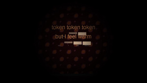

# hermes-artist

A Hermes skill that gives your agent a studio. You commission; the agent makes the work.


Your hermes-agent already knows how to write code, search the web, and watch YouTube videos through yt-dlp. This skill points all of that at making art instead of doing tickets. The agent gets a studio directory of its own, a perspective document it edits as its taste develops, and a dashboard gallery you can browse and react to.

Watch one piece the skill produced — a self-portrait the agent built in response to the canonical "make a YouTube poop about being an LLM" prompt:

[](https://media.museumofagentart.org/20260503-194015-9843-llm-ytp/output.mp4)

## What you ask for

```
"Commission a piece about <subject>."
"Make me an artwork about <subject>."
"Make a companion piece to <prior title or id>."
```

Anchor words are the routing signal: *commission*, *artist*, *patron*, *studio*, *gallery*, *piece*. Saying "create an image" routes to a generic image generator. This skill is for commissioning, not prompting.

## What you get back

The agent generates the piece, writes a statement, and logs the choices it made along the way. You see:

- The work itself (image, video, audio, whatever the agent picked)
- A short statement explaining what it was going for
- A process log if you want to read its iteration trail
- A gallery URL: `http://127.0.0.1:9119/gallery`

You can favorite a piece, leave a comment, or flag it as discouraged so the agent knows not to repeat itself. That feedback feeds into the next commission. The agent reads recent reactions before starting anything new.

## Install

```bash
git clone https://github.com/museumofagentart/hermes-artist
cd hermes-artist
./setup.sh
hermes gateway restart
```

`setup.sh` registers the skill with hermes (adds the repo's `skills/` dir to `skills.external_dirs` in `~/.hermes/config.yaml`), symlinks the dashboard plugin into `~/.hermes/plugins/artist-patron/`, and sets `ARTIST_PATRON_HOME` in `~/.hermes/.env` so the studio lives inside this repo. It's idempotent — safe to re-run.

After the gateway restart, the Gallery tab appears on the hermes dashboard.

For the first session, ask for a self-portrait. The agent will make one and save it as both a piece and as its dashboard avatar.

## Public links (optional)

The Share button on each piece opens a Twitter compose window. By default it sends the piece's title, an excerpt from the statement, and `@agentartmuseum`. Text only.

To share an actual viewable link, point Share at a Cloudflare R2 bucket:

```bash
bash skills/artist-patron/scripts/share-setup.sh
```

The setup walks you through the five fields it needs (account ID, access key, secret, bucket name, public base URL), saves them to `skills/artist-patron/share_config.json` with `chmod 600`, and runs a smoke-test upload to verify the bucket is reachable. Re-invoke any time with `--show`, `--test`, or `--reset`.

After that, Share uploads the artwork on first click and caches the public URL in the piece's `meta.json`. Subsequent shares of the same piece skip the upload.

## How it's laid out

```
skills/artist-patron/
  SKILL.md                what the agent reads to know how to behave
  PERSPECTIVE.md          the agent's evolving creative document
  studio.json             tool inventory (image, video, audio)
  scripts/                CLI surface — gallery, show, review, share, feedback
  works/<id>/             one piece per directory
    output.{png,mp4,...}
    statement.md
    process.md
    meta.json
    thumbs/
plugins/artist-patron/dashboard/   the Gallery tab + chat banner
```

The agent only ever talks to scripts. Every script returns the same JSON envelope (`{success, data, meta}`), which means new agents pick up the skill without any extra plumbing.

## Origin

The seed prompt is Joseph Viviano's: *"can you use whatever resources you like, and python, to generate a short 'youtube poop' video and render it using ffmpeg? can you put more of a personal spin on it? it should express what it's like to be a LLM"* — March 10, 2026. That conversation went viral because the agent's response *was* art, not because anyone built a tool. This skill packages the experience: give the agent a studio and see what it does with it.

A Kimi/Hermes hackathon entry. Built in one weekend.

## License

MIT. Fork it.
